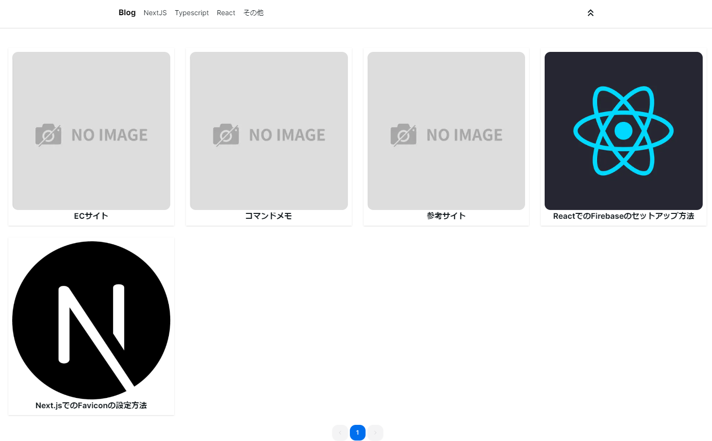
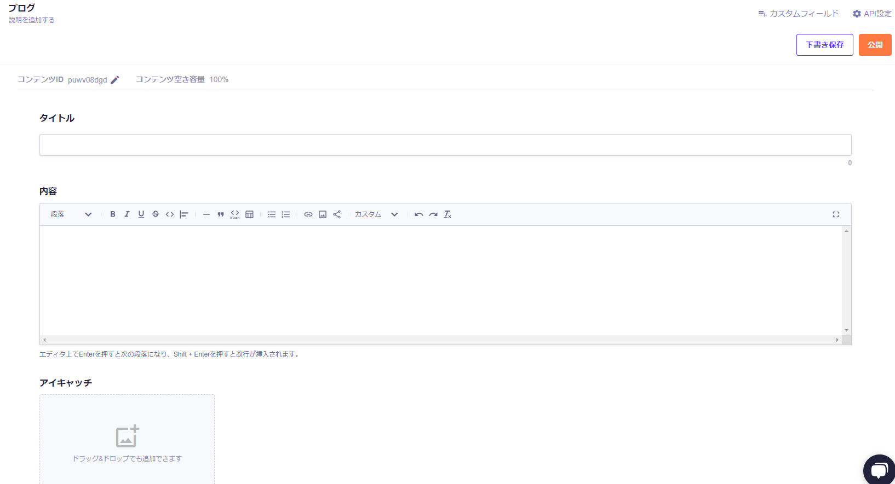
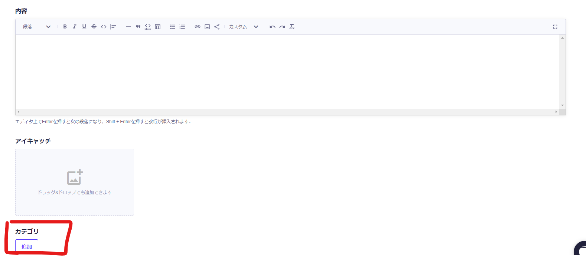
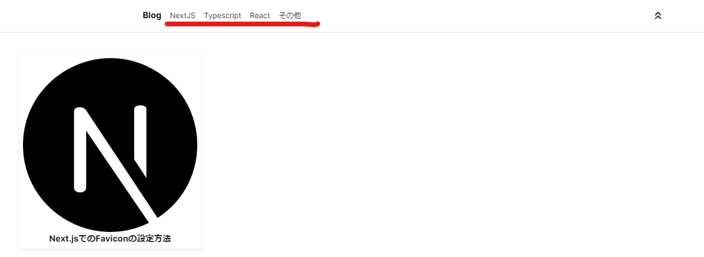
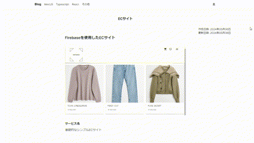
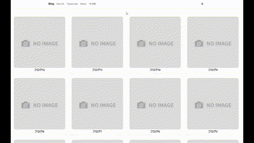

# Next.js + MicroCMS + Vercel を使用したJamstackブログ作成

  

---

## 作成した目的

自己学習を行った内容を備忘録のように残して即座に見るブログのようなものが個人的に欲しく作成

---

## ブログ概要

`Next.js` と `microCMS` を使用してより簡単に備忘録を作成できるように設計  
また、SSGを使用してより速度を高めてブログページを開けるようにしたいためにVercelを使用してCI/CDを利用して自動でブログ記事を作成するたびにビルドするように設計

---

## 制作期間

約2日

- 以下のYouTubeサイトを利用して作成

URL: [https://youtu.be/dNpONz4Yi04?si=iFltX-n8DyVM3WBP](https://youtu.be/dNpONz4Yi04?si=iFltX-n8DyVM3WBP)

---

## 主な開発環境

| ソフトウェア | 名称 | バージョン |
| :-- | :-- | :-- |
| OS | Windows 11 Home | 23H2 |
| Browser | Google Chrome | 18.2.0 |
| Editor | VSCode | 1.88.0 |
| JS実行環境 | Node.js | 10.2.4 |
| Framework | Next.js | 14.2.3 |
| Library | React | 18.0.0 |
| CSS Framework| Tailwind CSS | 3.4.1 |

---

## 主な機能

### ブログ記事作成後の自動デプロイ

[microCMS](https://microcms.io/)からブログ記事を作成するとVercelのWebhookを利用して自動デプロイが行われ、ブログサイトにて閲覧が可能になる(※ 1時間ごとに再ビルドするようにしているため気を付ける)  

  

### 記事をカテゴリーごとに分類

ブログ記事作成時にカテゴリーを指定することでブログサイトにてカテゴリーごとに自動で分類される

- microCMS
      

- ブログサイト
      

### ページトップに戻る機能

画面上部にクリックするとページトップまでスクロールするボタンを実装  

  

### ページネーション実装

1ページに12サイト表示されるようにページネーションを実装  

  
